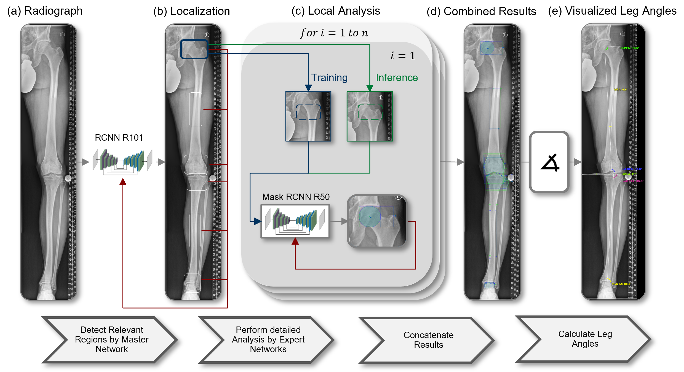

# Multicentric Development and Validation of a Multi-Scale and Multi-Task Deep Learning Model for a Comprehensive Orthopedic Lower Extremity Alignment Analysis in a Simulated Clinical Environment
>This repository represents the source code for a completely automated alignment analysis software


 


## Setup

* Install Python (Recommended 3.6+)
* Pytorch (Recommended 1.7+)
* Detectron2 (Recommended 0.2+)

## What does each file do? 

    .     
    ├── src                              # Source Code
    │   ├── main.py                      # main function, to preprocess, train and evaluate
    │   ├── categories.py                # def of all individual categories to split
    │   ├── train_detectron.py           # training and managing of all submodules
    │   ├── number_detection.py          # detect ruler if no sphere is available
    │   ├── angles_calc.py               # calculate alignment angles
    │   ├── eval_angle_test.py           # perform all evaluations
    │   └── extern_studies.py            # helpers for external analysis
    |
    ├── jsons                            # Folder containing all Networks
    │   └── categories                   # Subfolder with the specialised networks and sub-train datasets
    |
    ├── images                           # Folder with all training images
    |
    └── results                          # Contains the final results

## License
Creative Commons Attribution 4.0 International (CC-BY-4.0)


# Citation

If you use this project in any of your work, please cite:

```
tbd.
```
